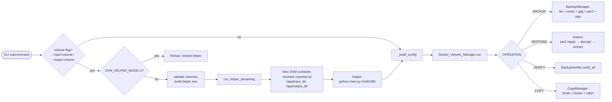
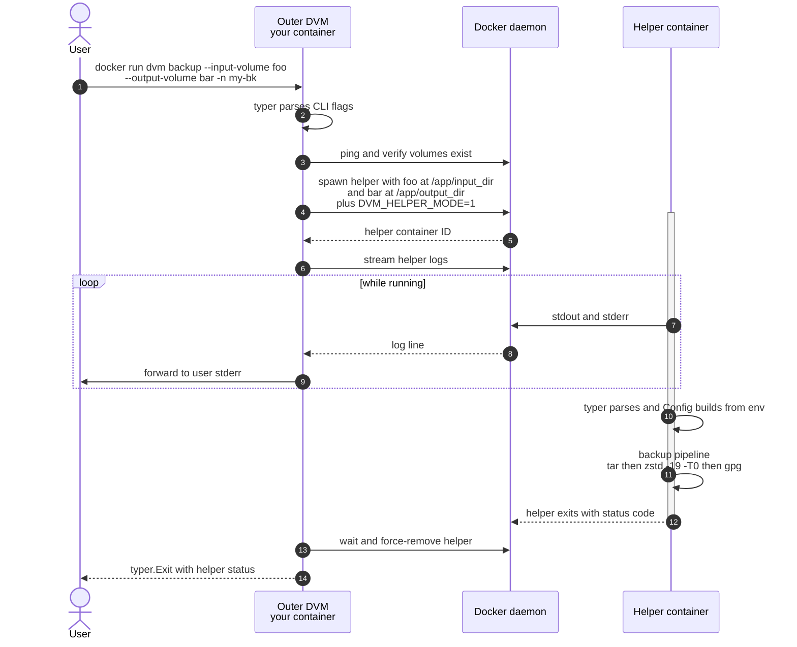

# Docker Volume Manager (DVM)

[](https://hub.docker.com/r/lpgonzalez/docker-volume-manager)
[](https://hub.docker.com/r/lpgonzalez/docker-volume-manager)
[](https://github.com/lpgonzalez/docker-volume-manager/actions/workflows/ci.yml)
[](https://hub.docker.com/r/lpgonzalez/docker-volume-manager/tags)
[](./LICENSE)

Container-native tool for backing up, restoring, verifying, copying and
renaming Docker volumes — with strong metadata preservation, modern
compression, GPG encryption + signing, PAR2 parity protection, and a
typer + rich CLI that drives both scripted and interactive workflows.

Runs as a single-shot Docker image (~134 MB on Alpine + Python 3.14),
multi-arch (**amd64 + arm64**). No `pip install`, no virtualenv on the host.

---

## Highlights

- **One-shot CLI**: `dvm backup | restore | verify | copy | rename | volumes | interactive`.
- **Five operations**:
  - `backup`: tar + compression (NONE / GZ / ZSTD) + optional GPG encryption (symmetric or asymmetric) + optional PAR2 parity + optional detached signature.
  - `restore`: decompress + decrypt + auto-repair via PAR2 if the archive was damaged.
  - `verify`: integrity report (existence, decryptable, decompressible, parity status).
  - `copy`: dir↔dir, dir↔volume, volume↔dir, volume↔volume — all with metadata preservation (uid/gid, mode, mtime, xattrs, symlinks).
  - `rename`: atomic Docker-volume rename (create target, copy with verify, delete source) with rollback.
- **Docker integration**: `--input-volume` / `--output-volume` flags pivot to a helper container; the outer process streams logs back. Works equally with bind mounts.
- **Volume manager**: `dvm volumes list/inspect/create/remove` + interactive explorer (size, container users, top-level contents).
- **Modern crypto**: GPG symmetric (`--encryption-key`) or asymmetric via keyring (`--recipient`) or via key file imported into a temporary keyring (`--recipient-key-file`). Detached signing (`--sign-key`).
- **Modern compression**: ZSTD-19 multi-core by default; GZ via `pigz` for universal interop. bz2/xz removed in favour of zstd.
- **PAR2 parity**: configurable percentage (`--parity`), single recovery volume (`-n1`) for compact layout.
- **Full metadata fidelity**: backup/restore preserve the exact **numeric uid/gid** (`--numeric-owner`), mode (incl. setuid/setgid), mtime, **extended attributes, POSIX ACLs and SELinux labels** (`tar --acls --xattrs`), symlinks and special files — critical for restoring service volumes (PostgreSQL, web servers).
- **Live progress + stall watchdog**: real-time byte progress (size, rate, ETA) on a TTY, throttled log lines off-TTY. A watchdog samples `/proc/<pid>/io` and terminates a backup/restore that stops doing I/O for `DVM_STALL_TIMEOUT` seconds (default 300, `0` disables).
- **Production-friendly logging**: rich console output on TTY; JSON / text file logs for non-interactive runs.
- **Multi-arch**: published for `linux/amd64` and `linux/arm64`; CI runs the full suite natively on both.
- **Tested**: 200+ tests across three tiers (unit / functional / integration), `ruff`-linted, with realistic data trees (varied permissions, UIDs/GIDs, symlinks, unicode names, xattrs).

---

## Supported tags and architectures

Published on Docker Hub: [`lpgonzalez/docker-volume-manager`](https://hub.docker.com/r/lpgonzalez/docker-volume-manager)

| Tag | Meaning |
|-----|---------|
| `latest` | The most recent release. |
| `X.Y.Z` (e.g. `3.0.0`) | A specific release (immutable). |
| `X.Y`, `X` | Rolling minor / major (`2.0`, `2`). |

Each tag is a multi-arch manifest covering **`linux/amd64`** and
**`linux/arm64`** — Docker pulls the variant matching your host automatically.

---

## Quick start

### From Docker Hub (no build needed)

```bash
mkdir -p in_dir out_dir logs
echo "hello" > in_dir/test.txt

# Backup ./in_dir → ./out_dir as a ZSTD archive
docker run --rm \
  -v "$PWD/in_dir:/app/input_dir" \
  -v "$PWD/out_dir:/app/output_dir" \
  -v "$PWD/logs:/app/logs" \
  lpgonzalez/docker-volume-manager \
  python main.py backup -n demo -c ZSTD -p 30

# Interactive wizard (needs a TTY and, for volume ops, the Docker socket)
docker run --rm -it \
  -v /var/run/docker.sock:/var/run/docker.sock \
  -v "$PWD/in_dir:/app/input_dir" \
  -v "$PWD/out_dir:/app/output_dir" \
  lpgonzalez/docker-volume-manager \
  python main.py interactive
```

### From source via the Makefile (local build)

```bash
make build-prod                          # build the local image

mkdir -p in_dir out_dir
echo "hello" > in_dir/test.txt

make run-backup backup-file-name=demo    # → out_dir/demo/<timestamp>/demo.tar.zst
make run-restore backup-file-name=demo   # restore it back
make run-interactive                     # the wizard
```

Direct CLI against the locally-built image:

```bash
docker run --rm \
  -v "$PWD/in_dir:/app/input_dir" \
  -v "$PWD/out_dir:/app/output_dir" \
  -v "$PWD/logs:/app/logs" \
  docker_volume_manager:3.0 \
  python main.py backup -n demo -c ZSTD -p 30 -k 'sup3rs3cr3t'
```

---

## Operations

### `backup`

Create a compressed (and optionally encrypted / parity-protected / signed)
archive of the source directory or volume.

```
dvm backup [OPTIONS]

Required:
  -n, --name TEXT             Backup base name. (Env: BACKUP_FILE_NAME)

Source:
  -i, --input PATH            Source dir inside container (default /app/input_dir).
      --input-volume NAME     Source is a Docker volume (pivots to helper).

Destination:
  -o, --output PATH           Destination dir inside container (default /app/output_dir).
      --output-volume NAME    Destination is a Docker volume (pivots to helper).

Compression:
  -c, --compression           NONE | GZ | ZSTD. Default ZSTD (level 19, all cores).

Parity:
  -p, --parity INT            PAR2 redundancy % (0-100). 0 disables parity.

Encryption (one of):
  -k, --encryption-key TEXT   GPG symmetric passphrase.
  -r, --recipient EMAIL       Public-key recipient (repeatable). Looked up in
                              the keyring — mount `~/.gnupg` into the container.
  -K, --recipient-key-file PATH
                              Public-key file (.asc, repeatable). Imported into
                              a throwaway keyring at runtime; no mount needed.

Signing:
      --sign-key FINGERPRINT  Produce a detached signature (.sig).
      --sign-key-passphrase   Passphrase for the signing key.

Logging:
  -l, --log-level             DEBUG | INFO | WARNING | ERROR | CRITICAL.
      --log-output            console,file,json_file (comma-separated).
```

#### Examples

```bash
# Plain ZSTD backup (default)
dvm backup -n daily

# Public-key encryption with key file (no keyring mount)
dvm backup -n confidential -K ./alice.asc

# Symmetric encryption + 30% parity + detached signature
docker run --rm \
  -v ~/.gnupg:/root/.gnupg:ro \
  -v $PWD/in:/app/input_dir \
  -v $PWD/out:/app/output_dir \
  docker_volume_manager:3.0 \
  python main.py backup \
    -n release-2026-Q1 -c ZSTD -p 30 \
    -k 'sup3rs3cr3t' \
    --sign-key ABCDEF1234567890

# Backup of a Docker volume to another volume (no host paths involved)
docker run --rm \
  -v /var/run/docker.sock:/var/run/docker.sock \
  docker_volume_manager:3.0 \
  python main.py backup \
    --input-volume mydata \
    --output-volume backups-store \
    -n mydata-bak -c ZSTD -p 50
```

### `restore`

```
dvm restore [OPTIONS]

  -n, --name TEXT              Backup base name to restore.
  -i, --input PATH             Dir / volume containing the timestamped backups.
      --input-volume NAME      Read backup from a Docker volume.
  -o, --output PATH            Restore destination.
      --output-volume NAME     Restore into a Docker volume.
  -t, --timestamp YYYYmmdd_HHMM[_NN]
                               Specific backup; latest is used if omitted.
  -k, --encryption-key TEXT    Symmetric passphrase. For asymmetric, ensure the
                               private key is in the active keyring.
      --overwrite/--no-overwrite
                               Overwrite non-empty destination (default: yes).
```

If the archive has PAR2 parity files, restore will detect corruption and
attempt repair before extraction. If repair fails, you get a clear error
and the destination is left untouched.

### `verify`

```
dvm verify -n NAME [-o OUTPUT_PATH | --output-volume NAME] [-k PASSPHRASE]
```

Reports `backup_exists`, `is_encrypted`, `can_decrypt`, `can_decompress`,
`parity_files_exist`, `parity_valid`, `parity_recovered`. PAR2 repair is
attempted automatically when validity fails; `can_decompress` is re-checked
after a successful recovery so the report reflects post-repair state.

### `copy`

Mirror with metadata preservation. Supports all four direction combinations:

```bash
# dir → dir (no Docker SDK needed)
dvm copy -i /app/input_dir -o /app/output_dir

# dir → volume (helper pivot)
dvm copy --output-volume mybak

# volume → dir
dvm copy --input-volume mydata -o /app/output_dir

# volume → volume (often used for migrations)
dvm copy --input-volume olddata --output-volume newdata
```

### `rename`

Docker has no native `docker volume rename`. DVM emulates it atomically:

1. Validate source exists, target doesn't, source isn't in use (or `--force`).
2. Capture source stats (file count + bytes).
3. Create target volume.
4. Copy contents through a helper container (uses `CopyManager` → metadata preserved).
5. Verify post-copy stats match source.
6. Remove source volume (unless `--keep-source`).

Any failure after step 3 rolls back the target. Source is **never** removed unless verification passes.

```bash
dvm rename old-name new-name [--keep-source] [--force] [--yes]
```

### `volumes`

```
dvm volumes list      [--size] [--orphans]
dvm volumes inspect NAME [--no-size] [--no-contents] [--max-entries N]
dvm volumes create NAME
dvm volumes remove NAME [--force] [--yes]
```

`size` and inspect's content listing spawn a one-shot helper container with
the volume mounted read-only — no manual mounting required.

All four are also available through the wizard's `volumes` submenu.

### `interactive`

```bash
make run-interactive
# or
docker run --rm -it \
  -v /var/run/docker.sock:/var/run/docker.sock \
  -v $PWD/in_dir:/app/input_dir \
  -v $PWD/out_dir:/app/output_dir \
  docker_volume_manager:3.0 \
  python main.py interactive
```

Loops a menu for backup / restore / verify / copy / rename / volumes / quit
until you exit. Errors don't kill the wizard — you return to the menu.

---

## Compression

| Option | Algorithm | Use when |
|---|---|---|
| `NONE` | tar only (`.tar`) | The target FS already compresses (Btrfs/ZFS), or content is already compressed (video, JPEG). |
| `GZ` | gzip / pigz (`.tar.gz`) | Universal interop — every tool reads it. `pigz` (multi-core) auto-detected when present. |
| `ZSTD` *(default)* | zstd-19 multi-core (`.tar.zst`) | Best general choice. ~xz ratio with 5-10× faster decompression. |

bz2 (`.tar.bz2`) and xz (`.tar.xz`) **are not produced** by DVM — zstd
dominates both on the speed/ratio Pareto front. DVM also no longer reads
those formats; if you have legacy archives, decompress them separately and
re-backup with ZSTD.

---

## Encryption

Three mutually-exclusive modes. Pick at most one per backup.

| Mode | Flag | Keyring needed? |
|---|---|---|
| Symmetric (passphrase) | `--encryption-key TEXT` | No |
| Asymmetric (named recipient) | `--recipient EMAIL\|FPR` | Yes — mount `~/.gnupg` |
| Asymmetric (key file) | `--recipient-key-file PATH` | No — imported to a temp keyring |

`--recipient` is more flexible (any number of recipients, can use existing
trust web). `--recipient-key-file` is more portable (no host mount needed)
but currently can't be combined with `--input-volume`/`--output-volume`
in the same invocation — DVM doesn't yet ship the temp keyring across the
helper boundary. For volume-based asymmetric backups, mount the keyring.

`SIGN_KEY` is independent: it produces a detached signature (`<archive>.sig`)
covering whatever the pipeline produced (encrypted-or-not), so a verifier
with the signer's public key can confirm authorship without decrypting.
Use `gpg --verify <archive>.sig <archive>` to verify.

---

## PAR2 parity

`--parity 0` (default) disables. Any value 1-100 enables PAR2 with that
recovery percentage — e.g. `--parity 30` produces enough parity blocks to
recover from 30% damage.

Generates exactly two artifacts (`-n1`):

- `<archive>.par2` — index file (~few KB).
- `<archive>.vol000+N.par2` — single volume containing all recovery blocks.

Verify or repair with any standard PAR2 tool (`par2 verify`, `par2 repair`),
including par2 on Windows. DVM also detects and auto-repairs corrupt
archives during `restore` and `verify` when parity is present.

---

## Docker volume integration

DVM can read/write Docker volumes directly without manual `-v` mounts. When
you pass `--input-volume` or `--output-volume`:

1. The outer container detects the volume flag.
2. Validates: socket reachable, volume exists, not already inside a helper.
3. Spawns a helper container running the same operation, with:
   - The named Docker volume mounted at `/app/input_dir` or `/app/output_dir`.
   - Bind mounts inherited from the outer container (so e.g. `/app/output_dir` from a host bind-mount is preserved when only `--input-volume` is set).
   - `DVM_HELPER_MODE=1` to prevent recursion.
4. Streams the helper's logs to the outer process's stderr.
5. Exits with the helper's status code.

Requires `-v /var/run/docker.sock:/var/run/docker.sock` on the outer run. The
Makefile targets that need the socket already do this (`run-interactive`,
`run-volumes-*`, anything passing `input-volume=`/`output-volume=`).

---

## Logging

```
LOG_LEVEL  = DEBUG | INFO (default) | WARNING | ERROR | CRITICAL
LOG_OUTPUT = comma-separated subset of: console, file, json_file
LOGS_PATH  = /app/logs (default; mount as /logs to persist)
```

- `console`: rich-formatted output to stderr; auto-detects TTY for colors and progress bars.
- `file`: text logs to `<LOGS_PATH>/docker_volume_manager.log`.
- `json_file`: structured JSON logs to `<LOGS_PATH>/docker_volume_manager.json`.

Progress bars only render in `console` when stderr is a TTY. In non-TTY
contexts (CI, log redirection), progress is reported as throttled INFO log
lines — no ANSI noise contaminates file logs.

---

## Makefile reference

```
make build-prod                       # build runtime image (~134 MB)
make build-test                       # build test image (~155 MB)
make test                             # unit + functional tests (~150)
make test-unit                        # only unit tests (~2s)
make test-functional                  # only functional (with system tools)
make test-integration                 # fast integration (Docker socket)
make test-integration-slow            # heavy integration (full pipelines)
make test-integration-all             # both
make coverage                         # coverage report

make run-backup [name=...] [compression=ZSTD] [parity=0] [encryption-key=...]
make run-backup-encrypt encryption-key=... [...]
make run-backup-parity encryption-key=... [parity=30]
make run-restore name=... [timestamp=...] [encryption-key=...]
make run-verify name=... [encryption-key=...]
make run-copy [overwrite=N]
make run-rename source=... target=... [keep-source=1] [force=1] [yes=1]
make run-interactive
make run-volumes-list [size=1] [orphans=1]
make run-volumes-inspect name=...
make run-volumes-create name=...
make run-volumes-remove name=... [force=1] [yes=1]

make run-devel                        # interactive bash shell in runtime image
make run-devel-test                   # interactive bash shell in test image
make stop / clean / bash
make save-image / load-image / push-to-repo
```

Any operation can also use Docker volumes by passing
`input-volume=NAME` and/or `output-volume=NAME`.

---

## Security notes

- **`/var/run/docker.sock` mount = root-on-host**. Any container with the
  socket mounted can do anything Docker can. Use only with trusted images
  in trusted environments. The Makefile only mounts the socket where
  required (interactive, volumes management, anything with volume flags).
- **GPG keyring**. Mount read-only when possible (`-v ~/.gnupg:/root/.gnupg:ro`).
  Prefer `--recipient-key-file` for asymmetric encryption when you only need
  public keys — DVM imports them into a throwaway keyring with `trust-model
  always` and removes the dir after the operation.
- **Secrets in argv**. Symmetric passphrases passed via `-k` show up in
  `docker inspect` until the container exits. The pivot path keeps secrets
  in env vars instead of argv to limit exposure.
- **Signing keys** require keyring access (private keys) — there's no
  equivalent of `--recipient-key-file` for signing yet. Mount your keyring.

---

## Performance notes

- **ZSTD-19 with `-T0`** (all cores) is the default compression. For 8-core
  machines, expect ~5-10× speedup over single-thread gzip at a slightly
  better ratio.
- **PAR2 multi-thread**: `par2cmdline` uses OpenMP by default — all cores
  are used for parity creation and recovery.
- **AES-NI / SHA extensions**: gpg uses libgcrypt which auto-detects and
  uses CPU crypto extensions. No flag needed.
- **Image size**: ~134 MB on disk (~34 MB compressed for distribution).
  Migrating from Debian slim to Alpine cut ~100 MB.
- **Pivot helpers**: spawning a helper container adds ~0.5-1 s per
  invocation. For one-shot backups this is negligible; for tight loops,
  prefer bind-mount paths to avoid the pivot.

---

## Testing

Three tiers, auto-marked by directory:

```
app/tests/unit/         # pure Python, fast (~2s)
app/tests/functional/   # uses tar/gpg/par2/zstd subprocesses (~5s)
app/tests/integration/  # uses Docker daemon (~10-50s)
```

Integration tests skip themselves cleanly when `/var/run/docker.sock`
isn't available. The suite includes 200+ tests with realistic data
trees (varied permissions, UIDs/GIDs, symlinks, unicode names, xattrs),
plus metadata-fidelity assertions on every round-trip.

```bash
make test                  # unit + functional (no Docker daemon needed)
make test-integration      # fast integration tier
make test-integration-slow # full backup/restore through helper containers
make lint                  # ruff check
make format                # ruff format + safe autofixes
```

CI (`.github/workflows/ci.yml`) runs `lint` + the full suite **natively on
both `amd64` and `arm64`** on every push and PR. Tagged releases
(`v*.*.*`) trigger `docker-publish.yml`, which builds the multi-arch image
with `buildx` and pushes it to Docker Hub (and syncs this README to the
repository's Overview page).

To cut a release: bump the version, push a `vX.Y.Z` tag, and CI does the
rest. For a manual multi-arch publish from your machine:

```bash
docker login
make release release-version=3.0.0    # build + push amd64+arm64 to Docker Hub
make release-dry release-version=3.0.0 # multi-arch build only, no push
```

---

## Operation flow

How a CLI invocation reaches an operation, with or without volume flags:



Helper-pivot timeline when `--input-volume` / `--output-volume` is passed:



## Architecture overview

```
app/
├── main.py                # thin shim → cli.main()
├── cli.py                 # typer app + op commands + wiring (thin layer)
├── cli_shared.py          # exit codes, consoles, parsing helpers
├── pivot.py               # helper-container pivot for volume ops
├── runners.py             # Config build + pivot dispatch + typed exit codes
├── volumes_cli.py         # `dvm volumes` sub-app + table/detail renderers
├── wizard.py              # interactive wizard
├── config.py              # typed Config dataclass + logger setup
├── progress.py            # TTY-adaptive progress (count / bytes modes)
├── process_monitor.py     # live byte progress + stall watchdog (/proc/io)
├── docker_client.py       # Docker SDK facade + helper-container spawn
├── gpg_keyring.py         # ephemeral GPG keyring for --recipient-key-file
├── health_check.py        # status file probe for HEALTHCHECK
└── operations/
    ├── docker_volume_manager.py  # dispatcher; map_compression
    ├── codecs.py          # single compression-codec registry
    ├── backup_files.py    # BackupManager: tar, compress, encrypt, sign, par2
    ├── restore_files.py   # restore() + extraction + decryption + par2 repair
    ├── copy_files.py      # CopyManager: dir↔dir with metadata preservation
    ├── verify_backup.py   # BackupVerifier
    ├── fs_overwrite.py    # shared overwrite/clear/YES helpers
    └── rename_volume.py   # rename_volume() — atomic with rollback
```

The runtime is a one-shot container: parses args → builds Config → runs
one operation → writes `/dev/shm/app_status.txt` → exits. The healthcheck
reads that file.

For Docker volume operations, the CLI pivots: when it detects volume flags
or runs commands like `dvm volumes inspect`, it spawns helper containers
via the Docker SDK. The helper inherits `DVM_HELPER_MODE=1` to prevent
recursion.

---

## License

Apache 2.0 — see [`LICENSE`](./LICENSE).

This is a permissive open-source license that requires:
- Preservation of copyright, license, and attribution notices in derivatives.
- A statement of changes in modified source files.
- Inclusion of the License text with redistributions.

It also includes an explicit patent grant from contributors. Each source
file carries a short SPDX header (`SPDX-License-Identifier: Apache-2.0`)
referencing the full LICENSE in this repo.

Copyright 2025-2026 Lisardo Prieto.
